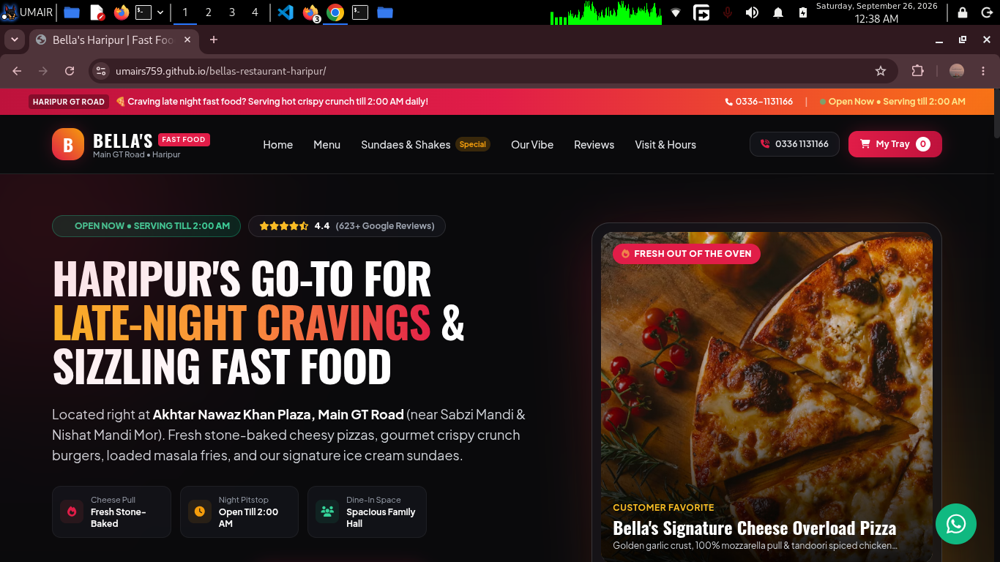
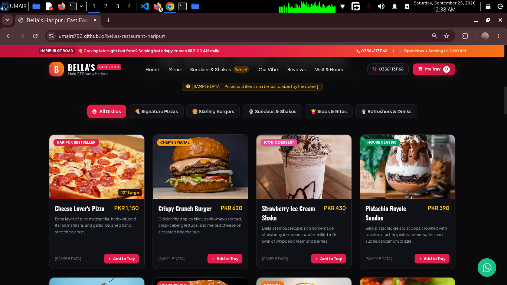
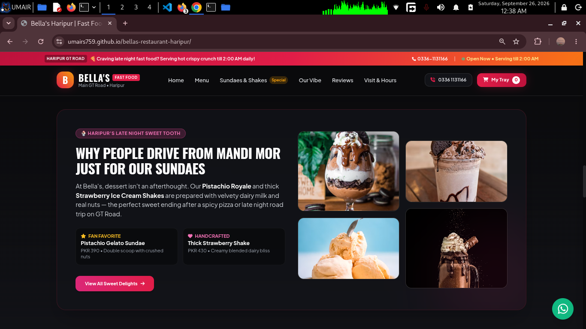

# 🍕 Bella's Fast Food Restaurant — Haripur (GT Road)

[](https://umairs759.github.io/bellas-restaurant-haripur/)
[](https://tailwindcss.com/)
[](https://fastapi.tiangolo.com/)
[](https://www.sqlite.org/)

An offline-first, mobile-optimized digital ordering portal and brand showcase crafted for **Bella's Fast Food Restaurant**, located at Akhtar Nawaz Khan Plaza, Main GT Road, Haripur. 

Features an interactive food tray with direct **0% commission WhatsApp order routing**, a real-time **Pakistan Standard Time (PKT) kitchen open-status ticker**, and an optional lightweight FastAPI backend for local receipt archiving.

---

## 📸 Visual Showcase

### 1. Hero & Late-Night GT Road Ticker


### 2. Interactive Menu & Smart Tray System


### 3. Dessert Showcase & Localized Story


---

## ✨ Key Features

* **⚡ 0% Commission Direct WhatsApp Checkout:** Customers curate their tray (pizzas, smash burgers, sides, sundaes) and submit orders directly to Bella's WhatsApp counter with auto-calculated subtotals and itemized breakdown slips.
* **🕒 Dynamic PKT Operating Hours Engine:** Client-side schedule logic synced to Pakistan Standard Time (UTC+5). Displays live `Open Now` or `Opens at 9:00 AM` status badges for late-night GT Road highway travelers (Mon till 1:00 AM, Tue–Sun till 2:00 AM).
* **📱 Mobile-First Native App Experience:** Fixed bottom navigation bar for quick access to dialing, category switching, cart drawer, and WhatsApp triggers.
* **📍 GT Road Navigation & Call Integration:** 1-tap Google Maps redirection for Akhtar Nawaz Khan Plaza (Darvesh, Haripur) and click-to-call direct dialer.
* **🔌 Dual-Mode Architecture:** Fully functional as a standalone static web app on GitHub Pages, with optional FastAPI + SQLite backend endpoints (`/api/orders`, `/api/contact`) for local desktop deployment.

---

## 🛠️ Tech Stack

| Layer | Technologies |
| :--- | :--- |
| **Frontend** | HTML5, Tailwind CSS, Lucide / FontAwesome 6, Modern Vanilla ES6+ |
| **Typography** | Plus Jakarta Sans, Oswald Display |
| **Backend (Optional)** | Python 3.10+, FastAPI, Uvicorn, SQLAlchemy, Pydantic |
| **Database** | SQLite3 |
| **Deployment** | GitHub Pages (Frontend CDN) |

---

## 📁 Repository Structure

```text
bellas-restaurant-haripur/
├── backend/
│   ├── database.py         # SQLite connection setup
│   ├── main.py             # FastAPI entrypoint & REST routes
│   ├── models.py           # SQLAlchemy Order & Contact models
│   ├── requirements.txt    # Python dependencies
│   └── schemas.py          # Pydantic validation schemas
├── frontend/
│   ├── app.js              # State logic & cart drawer handlers
│   ├── index.html          # Frontend single page portal
│   └── style.css           # Glassmorphism helpers & custom scrollbar
├── index.html              # Root deployment entrypoint
├── app.js                  # Root asset sync
├── style.css               # Root styling sync
├── mainpage.png            # Showcase screenshot: Hero section
├── screenshot.png          # Showcase screenshot: Menu grid
├── screenshot1.png         # Showcase screenshot: Desserts section
└── README.md
```

## 🚀 Quickstart & Setup

### 1. View Live Website (No Setup Required)

Visit the live portal on GitHub Pages:

👉 https://umairs759.github.io/bellas-restaurant-haripur/

### 2. Run Locally

Clone the repository:

git clone https://github.com/umairs759/bellas-restaurant-haripur.git

cd bellas-restaurant-haripur

Running the Frontend:

Simply double-click index.html or run with Python's built-in server:

python3 -m http.server 3000

Open http://localhost:3000 in your browser.

Running the Backend (Optional):
```
cd backend
python3 -m venv venv
source venv/bin/activate
pip install -r requirements.txt
uvicorn main:app --reload --port 8000
```

Swagger UI will be available at http://127.0.0.1:8000/docs.

### 📝 Business Inquiries & Pitch

This prototype is built to eliminate heavy commission aggregators for regional fast-food establishments across Khyber Pakhtunkhwa and Punjab, empowering restaurant operators with high-conversion direct sales.

    Designed & Developed by: Muhammad Umair

    Location: Lahore, Pakistan

    Target Restaurant: Bella's Fast Food, Akhtar Nawaz Khan Plaza, Main GT Road, Haripur

---

## 👨‍💻 About the Developer

Crafted with care by **Muhammad Umair** — Cybersecurity undergraduate & full-stack developer based in Lahore, Pakistan. Specializing in high-performance digital ordering workflows, restaurant automation, and web application security.

* **GitHub:** [@umairs759](https://github.com/umairs759)
* **Inquiries / Collaborations:** Open for custom restaurant tech setups & digital solutions.

---

## 📄 License

This project is licensed under the **MIT License** — see the [LICENSE](LICENSE) file for full details. 

You are free to use, modify, and distribute this codebase for educational and personal prototype implementations.
